# KCD Texas 2026 — "The 90-Minute IDP"

**Friday, May 15, 2026** · 10:30 AM CDT · Room 3 · KCD Texas
[The 90-Minute IDP: AI Ate My Implementation. Let's Build a Platform Together and Score What's Left.](https://kcd-texas-2026.sessionize.com/session/1149914)

A 90-minute hands-on workshop. Each of ~60 attendees gets their own pre-provisioned Amazon EKS cluster; using **Claude Code**, you'll bootstrap ArgoCD and watch it install an Internal Developer Platform — Kyverno policies, Prometheus + Grafana, Backstage — then score what AI ate, what it choked on, and whether the platform is actually usable end-to-end.



---

## Where to start

**If you're an attendee at the workshop on May 15:**
Open **[`kcd-texas-student-playbook.md`](kcd-texas-student-playbook.md)** and start at *"Before You Start."* Your TA will hand you a connection card with your AWS keys, cluster name, and the workshop repo URL. Have Claude Code installed and authenticated on your laptop before you walk in.

**If you're reviewing this for pre-share** (Accenture, organizers, replicators):
Read the *Orientation* block at the top of **[`kcd-texas-student-playbook.md`](kcd-texas-student-playbook.md)** — it's written for cold readers. Then **[`scorecard/SCORECARD-TEMPLATE.md`](scorecard/SCORECARD-TEMPLATE.md)** to see what attendees fill in, then **[`scorecard/PRESENTER-SCORECARD.md`](scorecard/PRESENTER-SCORECARD.md)** for the live on-stage scorecard the presenter fills on the projector.

**If you want to run your own version of this workshop:**
The repo is MIT-licensed — fork freely. Start with **[`kcd-texas-lab-setup-guide.md`](kcd-texas-lab-setup-guide.md)** (engineer-facing build runbook) and **[`kcd-texas-provisioning/`](kcd-texas-provisioning/)** (Terraform modules + cluster lifecycle scripts). The student-IAM lifecycle is in **[`scripts/`](scripts/)**.

**If you saw the talk and want to learn the framework:**
The Kyverno policies and admission controls in this workshop are server-side enforcement controls in the **Agentic Covenants** framework — a prevention-first matrix for autonomous-agent governance. Source of truth: [github.com/peopleforrester/agentic-covenants](https://github.com/peopleforrester/agentic-covenants).

---

## What's in here

| File | Purpose |
|---|---|
| [`kcd-texas-student-playbook.md`](kcd-texas-student-playbook.md) | The 90-minute walkthrough. Tour mode (default), DIY mode (optional), per-phase verification commands. |
| [`scorecard/SCORECARD-TEMPLATE.md`](scorecard/SCORECARD-TEMPLATE.md) | Per-student scorecard. 4 phase rows × 6 columns plus a 6-question wrap-up reflection. Opt-in submission. |
| [`scorecard/PRESENTER-SCORECARD.md`](scorecard/PRESENTER-SCORECARD.md) | Live on-stage scorecard. 6 rows × Install / Integration / Usability. Filled on the projector. |
| [`gitops/`](gitops/) | ArgoCD source. App-of-apps + four pre-committed Application manifests + Kyverno ClusterPolicies. |
| [`kcd-texas-lab-setup-guide.md`](kcd-texas-lab-setup-guide.md) | Engineer-facing build runbook (the "how it all works" doc). |
| [`kcd-texas-provisioning-README.md`](kcd-texas-provisioning-README.md) | Cluster provisioning detail (Terraform + EKS, cost breakdown). |
| [`kcd-texas-provisioning/`](kcd-texas-provisioning/) | Terraform modules and cluster lifecycle scripts. |
| [`scripts/`](scripts/) | IAM permissions boundary + student-user lifecycle. |
| [`assets/`](assets/) | Mermaid sources and rendered SVG diagrams (access model, cluster topology, day-of workflow, teardown checklist). |
| [`lab-requirements-may-2026-events.md`](lab-requirements-may-2026-events.md) | Lab specification across the May 2026 speaking events. |

## Repo layout

```
.
├── assets/                                # Diagrams (.mmd sources + .svg renders)
├── gitops/                                # GitOps source: ArgoCD on each cluster watches this tree
│   ├── bootstrap/
│   │   └── app-of-apps.yaml               # Root Application that watches gitops/apps/
│   ├── apps/                              # Child Applications: Kyverno, Prom, Backstage, etc.
│   └── manifests/                         # Custom resources (Kyverno policies, etc.)
├── scorecard/                             # Workshop scorecards
│   ├── SCORECARD-TEMPLATE.md              # Per-student
│   └── PRESENTER-SCORECARD.md             # Live on-stage
├── scripts/                               # Student IAM provisioning scripts
├── kcd-texas-provisioning/                # Terraform + cluster lifecycle scripts
│   ├── terraform/                         # main.tf, vpc.tf, eks.tf, variables.tf, outputs.tf
│   ├── batch-provision.sh
│   ├── batch-teardown.sh
│   ├── post-provision-setup.sh
│   ├── teardown.sh
│   └── iam-policy-workshop-provisioner.json
├── kcd-texas-student-playbook.md          # 90-minute student walkthrough
├── kcd-texas-lab-setup-guide.md           # Engineer-facing setup guide
├── kcd-texas-provisioning-README.md       # Cluster provisioning detail
├── lab-requirements-may-2026-events.md    # Lab spec across May 2026 events
├── README.md                              # This file
├── CLAUDE.md                              # Project notes for Claude Code agents
└── LICENSE                                # MIT
```

## Branch workflow

Working branch is `staging`. Changes land on `staging` first; promoted to `main` only after verification.

```bash
git checkout staging
git pull origin staging
# ... make changes ...
git push origin staging
```

## Sibling repos

- **[github.com/peopleforrester/agentic-covenants](https://github.com/peopleforrester/agentic-covenants)** — the framework this workshop is a worked example of. Source of truth for the Agentic Covenants matrix.
- **[github.com/peopleforrester/kubeauto-ai-day](https://github.com/peopleforrester/kubeauto-ai-day)** — the full 7-phase reference build (~10 hours) that the 4-phase 90-minute workshop is condensed from. Contains Falco, OTel, ESO, cert-manager, RBAC, NetworkPolicies, and end-to-end integration tests.

## License

[MIT](LICENSE) — fork it, run it, modify it. Attribution appreciated.

## Contact

**Michael Forrester** — provisioning lead and presenter.
Open an Issue on this repository for follow-on questions after the workshop.
